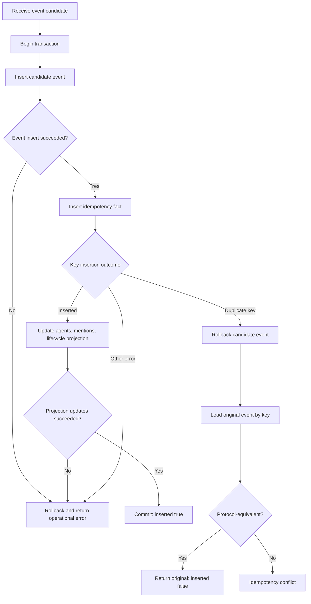
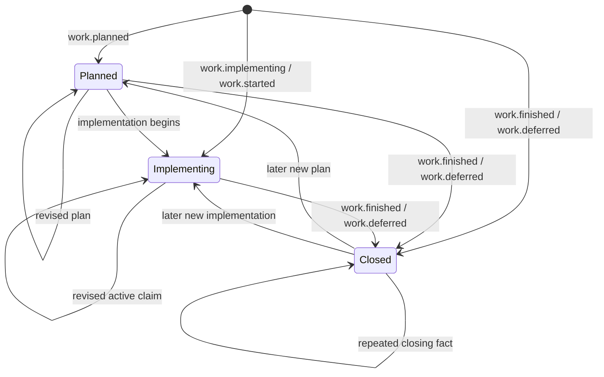
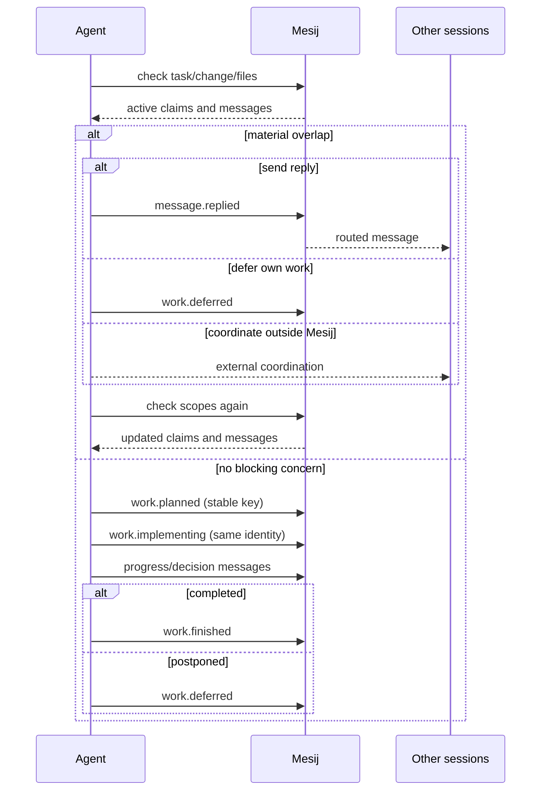
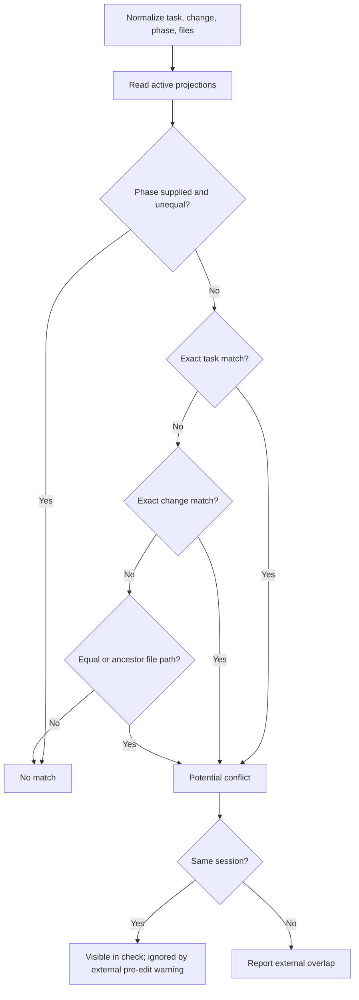
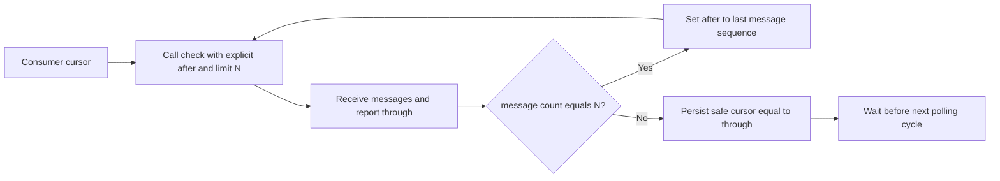
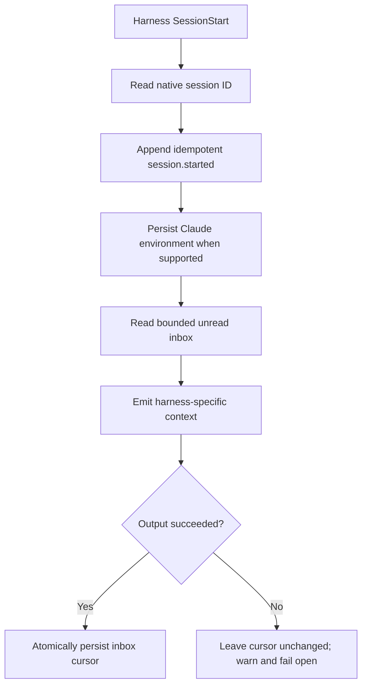
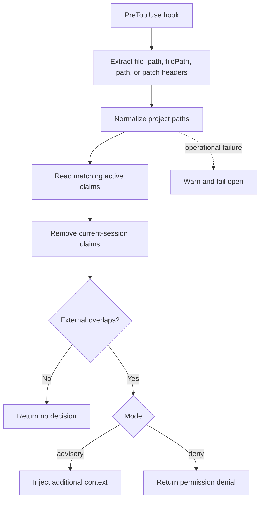
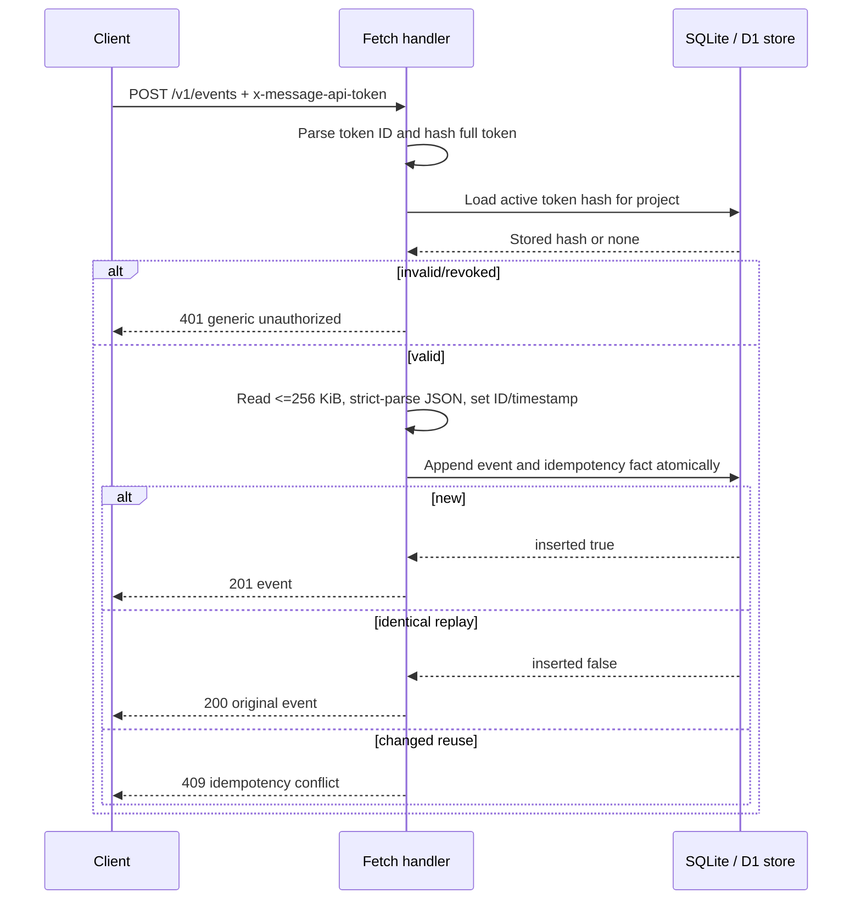

# Mesij coordination protocol

**Version:** Draft 0.1  
**Date:** August 30, 2026  
**Status:** Normative for the canonical Go implementation unless a section is
explicitly marked as a standalone API profile.

This document specifies the observable Mesij coordination protocol: identities,
events, lifecycle projections, conflict matching, messages, cursors, harness
hooks, and the standalone REST API profile.

The key words **MUST**, **MUST NOT**, **SHOULD**, **SHOULD NOT**, and **MAY** are
to be interpreted as normative requirements.

## Contents

1. [Scope and conformance](#1-scope-and-conformance)
2. [Identity](#2-identity)
3. [Event envelope](#3-event-envelope)
4. [Input vocabulary](#4-input-vocabulary)
5. [Idempotent append](#5-idempotent-append)
6. [Work lifecycle](#6-work-lifecycle)
7. [Conflict matching](#7-conflict-matching)
8. [Messaging and inboxes](#8-messaging-and-inboxes)
9. [Cursors, snapshots, and streams](#9-cursors-snapshots-and-streams)
10. [Harness hook protocol](#10-harness-hook-protocol)
11. [Standalone REST API profile](#11-standalone-rest-api-profile)
12. [Failure behavior](#12-failure-behavior)
13. [Non-guarantees](#13-non-guarantees)

## 1. Scope and conformance

### 1.1 Canonical protocol

The Go CLI and store under `cmd/mesij` and `internal/` define the canonical
protocol. A conforming canonical implementation supports:

- project, actor, and session identity;
- immutable, idempotent event append;
- task/change/file work lifecycle projections;
- conflict discovery;
- aliases, replies, mentions, and inboxes;
- monotonic sequence cursors and JSONL streams;
- lifecycle hook adapters.

Mesij is a **best-effort coordination channel**, not a lock manager.

- A claim **MUST NOT** be interpreted as exclusive ownership.
- A conflict report **MUST NOT** be interpreted as a mandatory denial unless a
  harness explicitly enables deny mode.
- Consumers **MUST NOT** assume delivery, acknowledgment, read receipts, leases,
  or automatic claim expiry.
- Accepted event facts **MUST** remain immutable.

### 1.2 Standalone REST API profile

The TypeScript implementation under [`api/`](../api/README.md) is a standalone
profile for Node.js and Cloudflare Workers/D1.

- It **MUST** use its own metadata-marked database.
- It **MUST NOT** be pointed at a canonical Go Mesij database.
- It implements tokens, event append, status, and bounded snapshot reads.
- It does not currently implement canonical active-work projections, conflict
  checks, aliases, reply resolution, mentions, inboxes, or streaming.

The profile shares event vocabulary but is not full canonical conformance.

## 2. Identity

### 2.1 Project identity

A canonical project is identified by a project name and canonical locator:

```text
project_id = lower_hex(first_16_bytes(SHA-256(locator + NUL + project_name)))
```

Locator selection follows this order:

1. An explicit `--db` or `MESIJ_DB` uses the canonical database path.
2. `--project name:NAME` sets the name but still discovers the surrounding Git,
   marker, or path locator.
3. `--project path:PATH` sets the discovery starting directory and bypasses
   ancestor marker discovery. In non-Git projects it pins that directory; inside
   Git, the containing repository root/common directory still defines the
   project.
4. A Git project uses its canonical Git common directory.
5. A non-Git project uses the nearest valid ancestor `.mesij-project` marker,
   then the canonical invocation path.

Linked Git worktrees sharing a common Git directory **MUST** derive the same
default project identity and database.

A legacy database at `<git-common-dir>/mesij/events.sqlite3` retains its legacy
location and project-ID derivation.

The standalone API uses an opaque configured project ID and does not reproduce
canonical discovery. A Worker **MUST** fail closed when its project ID is
missing, empty, `default`, or placeholder text.

### 2.2 Actor and session identity

- `actor` is a readable alias, not authenticated identity.
- `session` identifies one agent run and is the routing and idempotency
  principal.
- Every event **MUST** contain a nonempty actor and session.
- A harness **SHOULD** map its durable native session ID to one stable Mesij
  session.
- A harness **SHOULD NOT** create multiple Mesij sessions for one run.

Alias resolution is case-sensitive:

1. An exact session match wins.
2. An actor alias with exactly one known session resolves to that session.
3. An alias with multiple known sessions is ambiguous and **MUST** be rejected.
4. A missing alias or session **MUST** be rejected.

### 2.3 Source context

Canonical events record the writer-observed worktree, branch, and commit SHA.
These values are context only and do not prove that work was committed or
merged.

## 3. Event envelope

A canonical event has this JSON shape:

```json
{
  "sequence": 42,
  "id": "9d3f30b4d545174f7846093f4fb40c51",
  "project_id": "f8875062fdbb48fa89c6bba7fc1ffeb1",
  "actor": "agent-blue",
  "session": "session-123",
  "recipient_session": "session-456",
  "reply_to": "prior-event-id",
  "type": "message.posted",
  "payload": {},
  "projection": {},
  "worktree": "/repo/worktree",
  "branch": "feature/capture",
  "commit": "abcdef1234",
  "idempotency_key": "pay-142:update-1",
  "created_at": "2026-08-30T12:00:00.123456789Z"
}
```

| Field | Requirement |
| --- | --- |
| `sequence` | Database-global, monotonically increasing integer cursor |
| `id` | Program-generated random 16-byte lowercase hexadecimal ID |
| `project_id` | Canonical project identifier |
| `actor` | Nonempty readable alias |
| `session` | Nonempty stable run identifier |
| `recipient_session` | Optional direct-routing session |
| `reply_to` | Optional referenced event ID |
| `type` | Nonempty event type |
| `payload` | Valid JSON event data |
| `projection` | Optional derived lifecycle state returned by active reads |
| `worktree`, `branch`, `commit` | Writer-observed source context |
| `idempotency_key` | Nonempty key scoped to project and session |
| `created_at` | Program-generated UTC RFC 3339 timestamp |

Requirements:

- Clients **MUST NOT** supply or override sequence, ID, or timestamp.
- Ordering **MUST** use `sequence`, not timestamps.
- Project sequences **MAY** contain gaps.
- Events **MUST NOT** be updated or deleted.
- Conforming writers **MUST** treat idempotency mappings as immutable. Canonical
  SQLite triggers reject mapping updates/deletes, but direct SQL
  `INSERT OR REPLACE` is outside the supported trust boundary.
- Empty optional routing and source fields **MAY** be omitted from JSON.
- Consumers **SHOULD** accept RFC 3339 timestamps with nanosecond or millisecond
  precision.

## 4. Input vocabulary

| Input alias | Stored event type |
| --- | --- |
| `plan` | `work.planned` |
| `implement` | `work.implementing` |
| `start` | `work.started` |
| `finish` | `work.finished` |
| `defer` | `work.deferred` |
| `post` | `message.posted` |
| `reply` | `message.replied` |

Canonical lifecycle types are reserved for lifecycle commands. Arbitrary other
nonempty types MAY be posted.

Canonical `emit` input:

- **MUST** contain exactly one top-level JSON object;
- **MUST** use exactly one of `event` or `type`;
- **MUST** reject duplicate and unknown top-level fields;
- **MUST** reject `null` except as `data`;
- **MUST** reject empty file strings;
- **MUST** accept repeatable/multiple files;
- **MUST** reject input larger than 4 MiB.

The standalone API applies stricter nested duplicate-key and numeric
round-tripping validation and limits requests/events to 256 KiB.

## 5. Idempotent append

The idempotency scope is:

```text
(project_id, session, idempotency_key)
```

On first use, the canonical writer **MUST** atomically:

1. append the immutable event;
2. record the idempotency fact;
3. update the agent registry;
4. index mentions;
5. update lifecycle projections when applicable;
6. commit all changes or roll all of them back.

On key reuse, the implementation **MUST** load the original event and compare
project, actor, session, recipient, reply target, type, payload, and source
context. Generated ID, sequence, and timestamp are excluded.

- An equivalent retry returns the original event with `inserted:false`.
- A changed retry returns an idempotency conflict.
- `session.started` retries intentionally ignore source-context differences.



## 6. Work lifecycle

### 6.1 Work identity

Work identity is resolved in this order:

1. explicit `work`;
2. `task:` plus `task`;
3. `change:` plus `change`.

A lifecycle event **MUST** resolve a work identity. Active CLI claims additionally
require at least one task, change, or file target; `--work` alone is not enough
for planning/implementation commands.

Resolution is scoped to project and session. Historical lifecycle facts MAY be
used to reconnect task/change identifiers to an earlier work identity. If the
supplied scopes map to multiple identities, the caller **MUST** provide explicit
`work`.

### 6.2 State transitions



- `work.planned` creates active phase `plan`.
- `work.implementing` creates active phase `implement`.
- Legacy `work.started` is treated as implement.
- `work.finished` and `work.deferred` remove the matching active projection.
- Closing an already closed or never-active identity is accepted as an immutable
  fact; `Closed` means no active projection row.
- Closing facts remain in the immutable log.

For the same `(project, session, work_id)`, active projections conservatively
carry forward omitted work, task, change, and phase values. Files are a stable,
deduplicated union. Messages and arbitrary `data` are not carried forward.
There is no protocol operation for removing one file from an active projection.

The `active_work` table is disposable derived state. Projection reconstruction
**MUST** preserve malformed legacy events and record projection errors rather
than mutate or discard facts.

### 6.3 Agent work process



Claims never expire automatically. Agents **SHOULD** explicitly finish or defer
all work they no longer consider active.

## 7. Conflict matching

A coordination query MAY contain task, change, phase, and files.

An active claim matches when:

1. an optional phase filter equals the claim phase; and
2. at least one supplied target matches by:
   - exact task equality;
   - exact change equality; or
   - overlapping file paths.

If only phase is supplied, all active claims in that phase match.

File paths are normalized from the invocation directory. Canonicalization
resolves symlinks through the longest existing ancestor. Paths within the
project become project-relative forward-slash paths; outside paths remain
absolute.

Two paths overlap when they are equal or one is an ancestor of the other. `.`
overlaps every path. File matching is not glob matching.



Conflict detection is advisory and may miss unreported work or report broad
ancestor-path overlaps.

## 8. Messaging and inboxes

### 8.1 Broadcast and direct routing

An empty `recipient_session` is a broadcast. Canonical session-filtered event
reads include broadcasts, events addressed to the session, and events sent by
the session.

Direct messages remain in the shared project log. Routing **MUST NOT** be
described as private or confidential.

### 8.2 Replies

- `reply_to` resolves the original event's sender session.
- Unknown or cross-project reply targets **MUST** fail.
- `to` accepts an exact session or an unambiguous actor alias.
- `message.replied` requires `to` or a resolvable `reply_to`.
- If both are supplied, current canonical behavior does not require them to
  resolve to the same session.

### 8.3 Mentions

Canonical message text extracts case-sensitive actor mentions when `@` occurs at
the start of the message or after whitespace/punctuation, followed by:

```text
@ followed by [A-Za-z0-9][A-Za-z0-9._-]*
```

Mentions are deduplicated per event. Only `message.%` events appear in inboxes;
a mention inside an arbitrary type such as `progress.updated` is stored in the
event payload but does not become an inbox item.

### 8.4 Inbox selection

The inbox for session `S`:

- resolves the actor registered to `S`;
- includes only `message.%` events;
- includes messages sent by `S`, addressed to `S`, or mentioning S's actor;
- orders by ascending sequence;
- uses an exclusive `after` cursor;
- records no read receipt or delivery state.

```mermaid
sequenceDiagram
    participant A as Sender
    participant M as Mesij store
    participant B as Recipient
    alt explicit to
        A->>M: post/reply with actor alias or session
        M->>M: resolve exact session or unique alias
    else reply_to
        A->>M: reply referencing prior event
        M->>M: load prior event sender session
    end
    M->>M: index inline actor mentions
    M-->>A: immutable message event
    B->>M: inbox after cursor
    M->>M: select message.* sent by B, addressed to B, or mentioning actor(B)
    M-->>B: ascending events
    Note over A,B: Routing is public metadata; no acknowledgment is recorded
```

## 9. Cursors, snapshots, and streams

### 9.1 Canonical cursor rules

- `after` is exclusive.
- `through` is inclusive.
- Consumers **MUST NOT** assume project sequences are contiguous.
- Filtered consumers **SHOULD** advance to `through` only after draining all
  matching pages through that high-water.

`check` captures `through`, bounds its message read to that value, and returns
`through` even for quiet filtered reads. It does not return `has_more`. A
consumer requesting limit `N`, where `1 <= N <= 1000`, **MUST** treat `N`
returned messages as potentially incomplete, continue with `--after` set to the
last message sequence, and repeat. Values above 1,000 are unsafe for this test
because the store caps pages at 1,000. Only a page shorter than `N` proves that
all matches through that report's `through` were drained; the consumer may then
persist `through`. When `--after` is omitted, `check` shows the newest window;
when explicitly supplied it reads forward.

`tail` emits one immutable event per JSONL line. With `--after 0`, it starts at
the first project event. A non-following invocation returns one page and exits;
`--follow` drains every full page before waiting. Follow mode captures bounded
high-water marks and advances past quiet filtered intervals.

Current canonical `check` components are not read in one SQLite snapshot, so
active work and messages are best-effort relative to `through` under concurrent
writes.

The following is required **consumer logic** around repeated `check` calls; the
CLI performs one page per invocation:



### 9.2 Standalone API snapshot cursor

The standalone cursor binds version, exclusive `after`, inclusive `through`,
and actor/type/source-session filters. It is UTF-8 encoded and opaque to clients.

The API **MUST** reject malformed cursors, changed filters, `after > through`,
and future snapshot boundaries. A page MAY contain fewer events than requested
to stay within the 4 MiB response budget.

`next_cursor` continues the same bounded snapshot only while `has_more` is true.
`next_after` is informational when the snapshot is exhausted; the current MVP
does not accept it to start a later polling snapshot.

## 10. Harness hook protocol

The shared adapter accepts:

```text
mesij hook session-start --actor HARNESS
mesij hook inbox
mesij hook pre-edit [--mode advisory|deny] [--format vscode|copilot]
```

It accepts snake_case and camelCase fields:

- `session_id` / `sessionId`;
- `hook_event_name` / `hookEventName`;
- `tool_name` / `toolName`;
- `tool_input`, `tool_args`, or `toolArgs`.

Tool arguments MAY be objects or JSON-encoded object strings.

### 10.1 Session bootstrap and message delivery



One inbox drain is bounded by 1,000 scanned rows, 100 external messages,
approximately 32 KiB of context, and 4,096 bytes per formatted line. The current
session's own messages are omitted from injected context but consumed by the
cursor.

On `Stop`, `agentStop`, or `AgentStop`, unread external messages produce a
one-time block. Cursor persistence occurs only after successful output.

### 10.2 Pre-edit flow



Hooks only observe tools wired by a harness. Shell-based mutation can bypass
file-tool hooks. Shutdown hooks **MUST NOT** automatically finish claims.

## 11. Standalone REST API profile

### 11.1 Authentication

All `/v1/*` requests require:

```http
x-message-api-token: mesij_v1.<22-character-token-id>.<43-character-secret>
```

- The ID is 16 random bytes encoded as unpadded base64url.
- The secret is 32 random bytes encoded as unpadded base64url.
- Only `SHA-256(full token)` and the public ID are stored.
- Hash comparison **MUST** be constant-time.
- Plaintext tokens **MUST** be shown exactly once.
- Tokens are project-scoped and currently grant full read/write access.
- Missing, malformed, unknown, wrong-project, and revoked tokens all return the
  same generic `401`.
- Headers and plaintext tokens **MUST NOT** be logged.

### 11.2 Implemented routes

| Route | Auth | Behavior |
| --- | --- | --- |
| `GET /healthz` | No | Process liveness |
| `GET /v1/status` | Yes | Project ID, API version, latest sequence |
| `POST /v1/events` | Yes | Strict immutable event append |
| `GET /v1/events` | Yes | Bounded filtered snapshot replay |

Unimplemented canonical routes include conflict checks, agents, inbox, and
streaming.

### 11.3 Request flow



The Node server authenticates and routes before consuming request bodies,
closes connections with unread bodies, limits headers to 16 KiB, and defaults
to `127.0.0.1:7337`. Non-loopback deployment SHOULD use TLS and edge controls.

## 12. Failure behavior

### 12.1 Canonical CLI

| Exit | Meaning |
| ---: | --- |
| `0` | Success, identical retry, or fail-open hook warning |
| `1` | Runtime, store, resolution, or idempotency failure |
| `2` | Invalid command, flags, or input contract |

Canonical `emit` failures are JSON objects containing `ok:false`, `error`, and
`exit_code`.

### 12.2 Standalone HTTP

| Status | Meaning |
| ---: | --- |
| `400` | Invalid JSON, query, cursor, lifecycle, or reply shape |
| `401` | Generic authentication failure |
| `404` | Unknown route |
| `405` | Unsupported method |
| `409` | Idempotency conflict |
| `413` | Request/event exceeds 256 KiB |
| `500` | Internal failure |
| `503` | Unsafe or missing Worker project configuration |

Errors **MUST NOT** expose credentials, token hashes, or sensitive headers.

## 13. Non-guarantees

Mesij explicitly does not provide:

- file locks or exclusive ownership;
- guaranteed delivery or read receipts;
- automatic claim expiration;
- confidentiality for direct messages;
- complete conflict detection when agents fail to report work;
- timestamp-based ordering;
- automatic completion on session shutdown;
- canonical projection parity in the standalone API MVP.

Consumers should treat immutable events as primary facts and projections as
rebuildable, advisory state.
